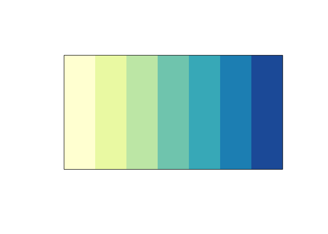

<!-- README.md is generated from README.Rmd. Please edit that file -->

# palap

<!-- badges: start -->

[](https://www.tidyverse.org/lifecycle/#experimental)
<!-- badges: end -->

The goal of palap is to provide “reflective” colour palettes. Broadly
speaking, there are three categories of colour palette:

1.  **Qualitative**: categorical variables
2.  **Sequential**: low to high numeric values
3.  **Diverging**: negative to positive values

However,a fourth colour palette is needed, to cover cases where things
diverge, but maintain some constant value/meaning as they get further
from the center point. The proposed name for this is a “reflective”
colour palette.

At the moment this package exists as a proof of concept, and a place to
explore this idea. It is currently drawing heavily from
[scico](https://github.com/thomasp85/scico).

## Installation

You can install the released version of palap from github with:

``` r
# install.packages("remotes")
remotes::install_github("njtierney/palap")
```

# Example

``` r
library(palap)
library(scales)
show_col(palap(15), label = FALSE)
```



``` r
show_col(palap(15, direction = -1), label = FALSE)
```


``` r

show_col(palap(15, palette = "lajolla"), 
         label = FALSE)
```


``` r
show_col(palap(15, palette = "lajolla", direction = -1),
         label = FALSE)
```


In the future there may be a magic function that allows for creation of
“reflective” colour palettes - perhaps similary to
[paletti](https://github.com/EdwinTh/paletti).
